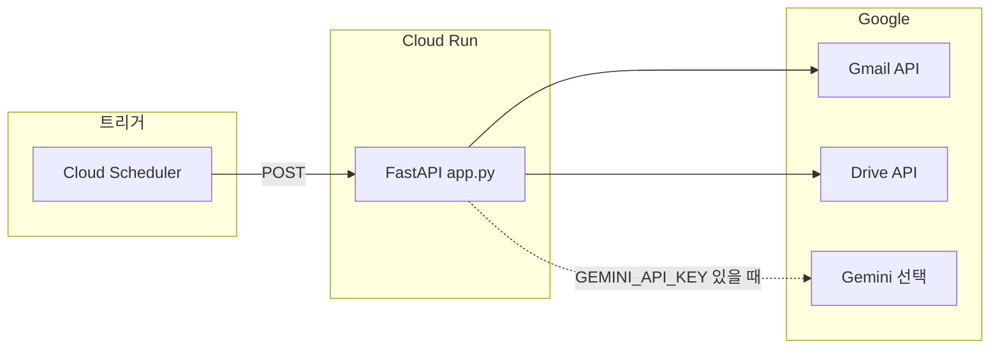
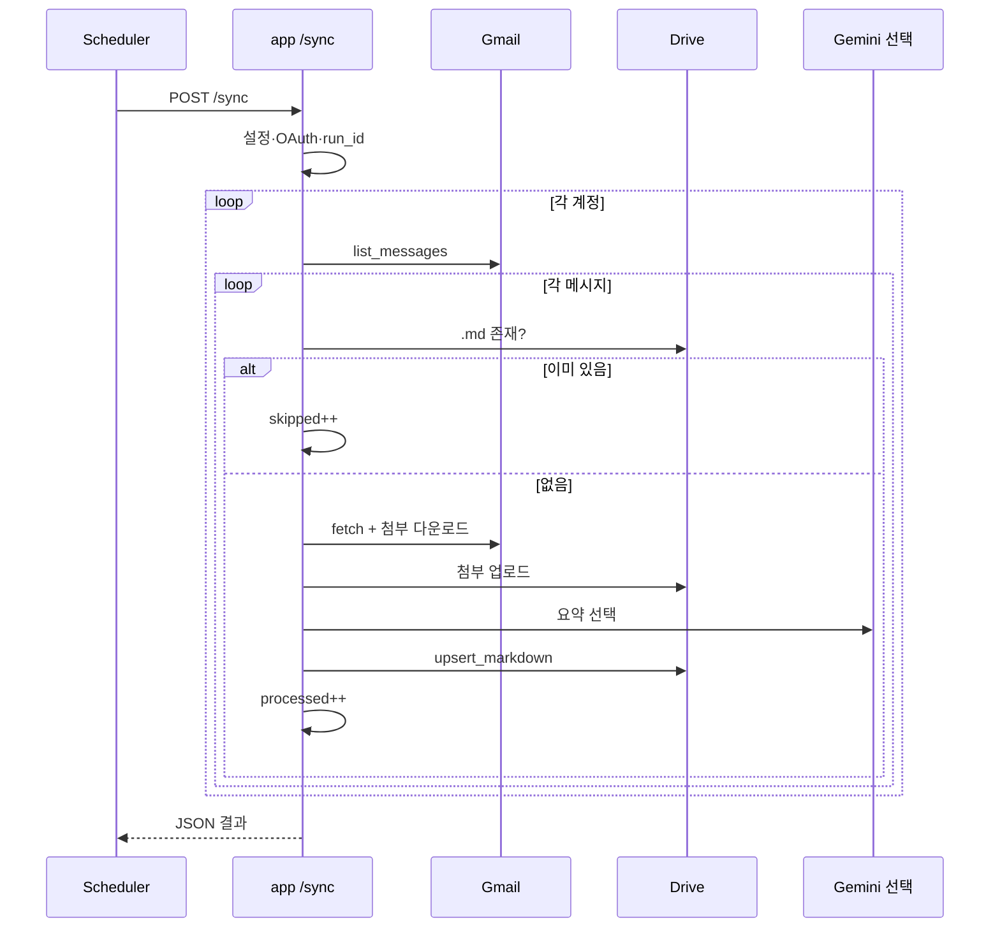
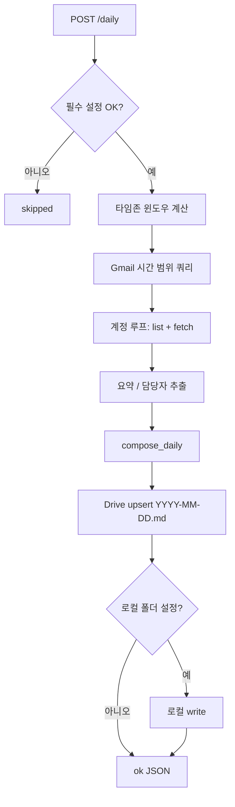

# TeamWorkHub 스토리보드

이 문서는 **TeamWorkHub** 서비스(`src/app.py` 중심)의 동작을 **장면(패널)** 단위로 시각화한 스토리보드입니다. 발표·온보딩·기획 검토용으로 쓸 수 있습니다.

### 시각 스토리보드 (그림)

아래 PNG는 **①스케줄 → ②Gmail → ③Drive·md 정리 → ④옵시디언** 네 칸으로 그린 흐름도입니다.

#### 파일이 안 보일 때

그림 파일은 생성 직후 Cursor 쪽 `assets`에 먼저 저장될 수 있습니다. 위 미리보기가 깨지면 `docs` 폴더를 만든 뒤, 아래 파일을 **`docs/storyboard-flow-ko.png`** 로 복사하세요.

`C:\Users\ParkEunJin\.cursor\projects\c-Users-ParkEunJin-teamworkhub\assets\storyboard-flow-ko.png`

---

## 전체 한 줄 요약

**스케줄러가 Cloud Run을 깨우면 → Gmail에서 메일을 읽고 → (선택) Gemini로 요약 → Drive(및 선택 시 로컬 Obsidian 폴더)에 마크다운으로 남긴다.**

---

## 장면 0 — 무대 세팅 (인프라)

| 패널 | 화면/설명 | 등장 요소 |
|------|-----------|-----------|
| **0-A** | 평일 아침, 사용자는 평소처럼 메일을 받는다. | Gmail |
| **0-B** | GCP Cloud Scheduler가 정해진 시각에 HTTP POST를 보낸다. | `POST /sync` (예: 08:00), `POST /daily` (예: 09:00) |
| **0-C** | 요청은 Cloud Run에 있는 FastAPI 앱으로 들어간다. | `src/app.py` — `health`, `sync`, `daily` |
| **0-D** | 앱은 사용자 OAuth(Refresh Token)로 Gmail·Drive API를 호출한다. | `src/auth.py`, 환경 변수 |

---

## 장면 1 — 건강 확인 (`GET /health`)

| 패널 | 액션 | 결과 |
|------|------|------|
| **1-A** | 로드밸런서·스케줄러·모니터가 `/health`를 친다. | 200, `{"status":"ok","service":"teamworkhub"}` |
| **1-B** | 인증 없이 즉시 응답 — “서비스 살아 있음”만 확인. | Cloud Run 헬스체크 용도 |

---

## 장면 2 — 메일 한 통씩 동기화 (`POST /sync`)

**스토리:** “라벨에 쌓인 메일 목록을 본 뒤, 아직 Drive에 없는 메일만 처리한다.”

| 패널 | 단계 | 코드/모듈 연결 |
|------|------|----------------|
| **2-A** | `run_id` 발급, 설정 로드 | `uuid`, `config.load()` |
| **2-B** | 필수 env 없으면 **skipped** 로 끝 | `validate_for_sync()` |
| **2-C** | OAuth로 Drive 서비스 생성 실패 시 **error** | `build_credentials`, `build_drive_service` |
| **2-D** | 단일 계정 또는 `GMAIL_ACCOUNTS_JSON` 다계정 루프 | `AccountConfig` |
| **2-E** | 계정마다 Gmail 서비스 빌드 → `list_messages` | `gmail_client.list_messages` |
| **2-F** | 메일마다 `twh_{messageId}.md` 파일명이 Drive에 이미 있으면 **통째로 스킵** (멱등) | `find_file_by_name`, `filename_for` |
| **2-G** | 없으면 `fetch_message`로 본문·메타 파싱 | `gmail_client.fetch_message` |
| **2-H** | 첨부파일 바이트 다운로드 → Drive 업로드 | `download_attachment`, `upload_attachment` |
| **2-I** | (선택) Gemini로 한국어 요약 | `summarizer.summarize` |
| **2-J** | `md_writer.compose`로 Obsidian용 `.md` 생성 → Drive `upsert_markdown` | **커밋 포인트** |
| **2-K** | `LOCAL_OUTPUT_DIR` 있으면 같은 내용을 로컬 경로에도 저장 | `Path.write_text` |
| **2-L** | 집계: `processed` / `skipped` / `errors` → 항상 HTTP 200 JSON | `status`: ok / partial / error |

---

## 장면 3 — 야간 메일 모아 데일리 노트 (`POST /daily`)

**스토리:** “어제 18:00 ~ 오늘 08:59 (설정 타임존) 사이 메일을 모아 **하나의** `YYYY-MM-DD.md`로 만든다.”

| 패널 | 단계 | 코드/모듈 연결 |
|------|------|----------------|
| **3-A** | 설정 검증·OAuth·Drive — `/sync`와 동일한 전제 | `validate_for_sync`, `build_*` |
| **3-B** | `ZoneInfo(TIMEZONE)`으로 ‘오늘’ 날짜·윈도우 계산 | `period_start` / `period_end` |
| **3-C** | Gmail 검색 쿼리: `after:` / `before:` Unix 타임스탬프 | `gmail_q` |
| **3-D** | 계정별 `list_messages(..., q=gmail_q)` 후 전부 `fetch_message` | 수집 루프 |
| **3-E** | `analyze_email`로 요약·담당자 후보; 없으면 `extract_assignees` 정규식 보강 | `summarizer`, `assignee` |
| **3-F** | `compose_daily`로 데일리 노트 마크다운 생성 | `daily_writer` |
| **3-G** | `DAILY_OUTPUT_FOLDER_ID` 또는 기본 출력 폴더에 `upsert_markdown` | Drive |
| **3-H** | `LOCAL_DAILY_OUTPUT_DIR` 또는 `LOCAL_OUTPUT_DIR`에 로컬 저장 | 선택 |
| **3-I** | 응답: `date`, `email_count`, `status` | HTTP 200 |

---

## 장면 4 — 사용자 관점의 하루 (내러티브)

1. **밤·새벽:** 동료·알림 메일이 Gmail에 쌓인다.  
2. **아침 `/sync`:** 각 메일이 `twh_*.md`와 첨부로 Drive 폴더에 복제된다 (이미 처리된 메일은 건너뜀).  
3. **조금 뒤 `/daily:** 같은 기간 메일이 한 페이지 데일리 노트로 요약된다.  
4. **Obsidian 사용자:** Drive 동기화 또는 `LOCAL_*` 경로로 볼트에 노트가 나타난다.

---

## 모듈 ↔ 역할 치트시트

| 모듈 | 스토리보드에서 맡는 역할 |
|------|-------------------------|
| `app.py` | 감독 — 엔드포인트·루프·에러 집계 |
| `config.py` | 촬영 조건 — env 로드·검증 |
| `auth.py` | 출입증 — OAuth → API 클라이언트 |
| `gmail_client.py` | 메일 읽기·첨부 다운로드 |
| `drive_client.py` | Drive에 파일 생성·멱등 업로드 |
| `md_writer.py` | 메일 1통 = 노트 1개 마크다운 |
| `daily_writer.py` | 하루 치 = 데일리 노트 1파일 |
| `summarizer.py` | AI 요약·데일리용 분석 |
| `assignee.py` | 담당자 이름 후보 (데일리 보강) |

---

## Phase 2 (현재 코드 주석 기준 — 미구현)

- Gmail Watch + Pub/Sub로 **실시간** 트리거 (지금은 스케줄 폴링).  
- Jira 연동, Git 푸시 등은 README에 명시된 범위 밖.

---

*본 문서는 저장소의 `README.md` 및 `src/app.py` 흐름을 바탕으로 작성되었습니다.*
